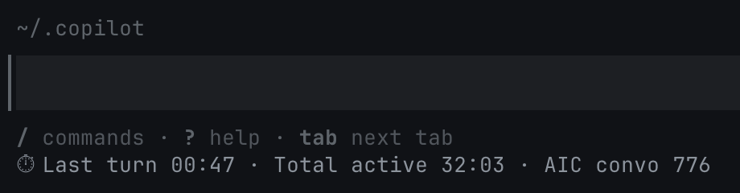

# Copilot Statusline Metrics

Copilot Statusline Metrics adds a Copilot CLI status line that shows current turn time, total active agent time, and persisted AIC usage for the current conversation.



```text
Timer Turn 00:08 | Total active 03:41 | AIC convo 66
Timer Last turn 00:12 | Total active 03:53 | AIC convo 68
```

## Features

- Shows current turn elapsed time while Copilot works.
- Shows the last turn duration after Copilot returns.
- Shows cumulative active agent time for the conversation.
- Persists conversation AIC totals across Copilot CLI restarts.
- Records AIC deltas into SQLite for day, week, month, conversation, and event queries.
- Bundles a Copilot CLI skill with ready-to-run SQLite query examples.
- Bundles a Copilot CLI extension with status, query, install, and uninstall tools.

## Requirements

- GitHub Copilot CLI with `statusLine` support.
- `bash`, `jq`, `sqlite3`, `awk`, `sed`, and `date`.
- macOS, Linux, or WSL. Windows users can run the hook through WSL or Git Bash.

## Install

Clone the repository:

```bash
git clone https://github.com/andrewDoing/copilot-statusline-metrics.git
cd copilot-statusline-metrics
```

Run the installer:

```bash
./install.sh
```

The installer copies:

- `bin/copilot-statusline-metrics` to `~/.copilot/bin/copilot-statusline-metrics`
- `skills/aic-metrics` to `~/.copilot/skills/aic-metrics`
- `.github/extensions/copilot-statusline-metrics` to `~/.copilot/extensions/copilot-statusline-metrics`

The installer updates `~/.copilot/settings.json`:

```jsonc
{
  "statusLine": {
    "type": "command",
    "command": "~/.copilot/bin/copilot-statusline-metrics",
    "padding": 1
  }
}
```

Restart Copilot CLI or run `/restart` after installing.

Confirm the extension loaded:

```text
/env
```

Ask Copilot to query the installed extension:

```text
Use copilot_statusline_metrics_status to show the statusline metrics setup.
```

Run the local test suite:

```bash
npm test
```

## Query AIC usage

Daily:

```bash
sqlite3 ~/.copilot/statusline-metrics.db \
  "SELECT day, printf('%.4f', aic) AS aic, conversations
   FROM aic_daily
   ORDER BY day DESC;"
```

Weekly:

```bash
sqlite3 ~/.copilot/statusline-metrics.db \
  "SELECT week, printf('%.4f', aic) AS aic, conversations
   FROM aic_weekly
   ORDER BY week DESC;"
```

Monthly:

```bash
sqlite3 ~/.copilot/statusline-metrics.db \
  "SELECT month, printf('%.4f', aic) AS aic, conversations
   FROM aic_monthly
   ORDER BY month DESC;"
```

Conversation totals:

```bash
sqlite3 ~/.copilot/statusline-metrics.db \
  "SELECT conversation_id,
          printf('%.4f', persisted_aic_nano / 1000000000.0) AS aic,
          datetime(updated_at, 'unixepoch', 'localtime') AS updated_at
   FROM conversations
   ORDER BY updated_at DESC;"
```

Recent deltas:

```bash
sqlite3 ~/.copilot/statusline-metrics.db \
  "SELECT datetime(created_at, 'unixepoch', 'localtime') AS observed_at,
          conversation_id,
          printf('%.4f', delta_aic_nano / 1000000000.0) AS delta_aic
   FROM aic_events
   ORDER BY created_at DESC
   LIMIT 50;"
```

## Copilot CLI extension tools

After install and restart, the extension contributes these tools:

- `copilot_statusline_metrics_status`
- `copilot_statusline_metrics_query_aic`
- `copilot_statusline_metrics_install`
- `copilot_statusline_metrics_uninstall`

Use the query tool to ask Copilot for daily, weekly, monthly, conversation, or recent-event AIC usage.

## Database

The default database path is:

```text
~/.copilot/statusline-metrics.db
```

Override it with:

```bash
export COPILOT_STATUSLINE_DB=/path/to/statusline-metrics.db
```

The schema includes:

- `schema_meta`: schema version marker.
- `conversations`: current persisted AIC total for each conversation.
- `aic_events`: one row per positive AIC delta.
- `aic_daily`: daily rollup view.
- `aic_weekly`: weekly rollup view.
- `aic_monthly`: monthly rollup view.

## Uninstall

Run:

```bash
./uninstall.sh
```

The uninstaller removes the hook, skill, extension, and matching `statusLine` setting. It keeps the SQLite metrics database.

## Tests

Run:

```bash
./tests/run.sh
```

The test suite uses temporary `HOME`, `COPILOT_HOME`, and SQLite database paths.

## Limitations

- AIC day/week/month history starts when `aic_events` begins recording.
- The status line updates on Copilot CLI's render cadence, usually every few seconds.
- Copilot CLI must provide `transcript_path` and `ai_used` in the `statusLine` payload.

## Privacy

Read [docs/privacy.md](docs/privacy.md) for storage details.

## Compatibility

Read [docs/compatibility.md](docs/compatibility.md) for Copilot CLI payload assumptions and troubleshooting.
